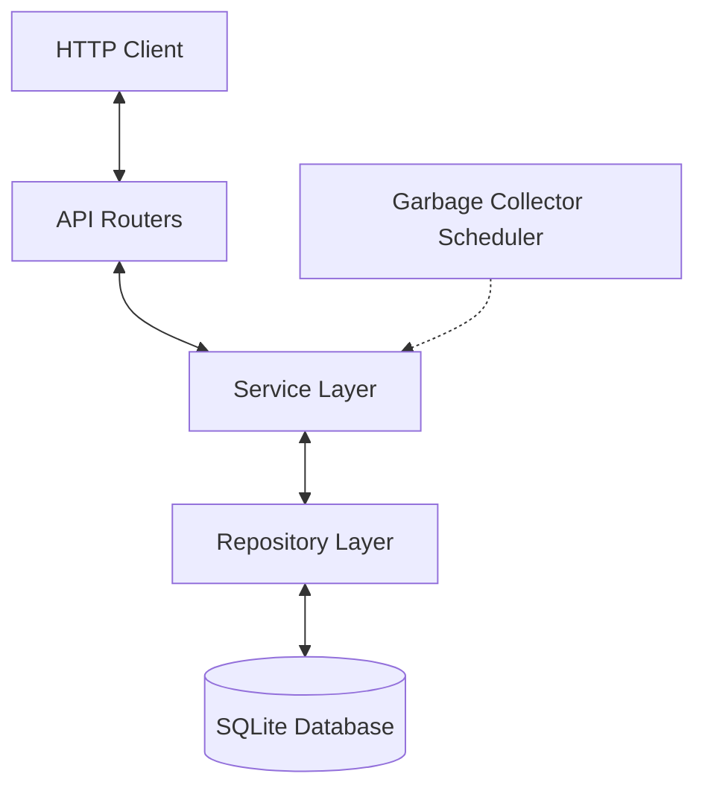
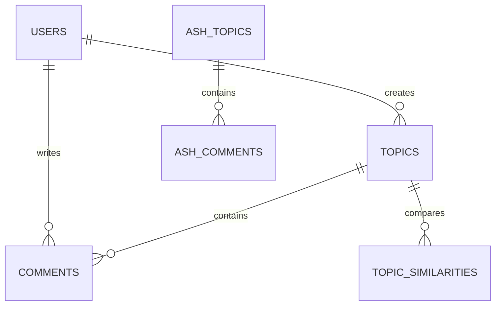

# 🏗️ Modakbul (모닥불) System Architecture & Design

This document details the system design, database schemas, and service-repository architecture of the **Modakbul** backend API server.

---

## 📂 Architecture Overview

Modakbul adopts a **Layered Architecture** to decouple HTTP routing, business logic, and database access.

1. **API Routers (`api/routers/`)**: Handles HTTP requests, input validation via Pydantic Schemas, and returns HTTP responses.
2. **Service Layer (`services/`)**: Implements core business logic, including the variable burn-rate calculations, cosine similarity evaluation, and calling repository functions.
3. **Repository Layer (`repositories/`)**: Performs raw SQLite operations (queries, inserts, updates). Data is passed using Python primitive types (e.g., `dict`, `int`, `str`) to maintain isolation.
4. **Database (`db/`)**: Relational SQLite database optimized for concurrent operations using WAL mode.

---

## 🗄️ Database Schema Design

The system maintains active tables for real-time discussions and archive tables for expired posts ("ash").

### 1. Active Tables (Ephemeral Feed)

#### `users`
Represents registered users.
- `id`: INTEGER (Primary Key, Auto-Increment)
- `username`: VARCHAR(31) (Unique, Not Null)
- `password_hash`: VARCHAR(60) (Bcrypt hashed, Not Null)
- `nickname`: VARCHAR(31) (Not Null)
- `created_at`: DATETIME (ISO Format, Default `now`)

#### `topics`
Represents active bonfires.
- `id`: INTEGER (Primary Key, Auto-Increment)
- `user_id`: INTEGER (Foreign Key referencing `users.id` on delete cascade)
- `content`: VARCHAR(127) (Not Null)
- `comment_count`: INTEGER (Default 0)
- `expires_at`: DATETIME (ISO Format, Index for Lazy Deletion)
- `created_at`: DATETIME (ISO Format)
- `embedding`: TEXT (JSON string of 128-dimensional L2-normalized vector)
- `is_ash`: INTEGER (Default 0, set to 1 when logically locked/expired)

#### `comments`
Represents firewood added to a bonfire.
- `id`: INTEGER (Primary Key, Auto-Increment)
- `user_id`: INTEGER (Foreign Key referencing `users.id` on delete cascade)
- `topic_id`: INTEGER (Foreign Key referencing `topics.id` on delete cascade)
- `content`: VARCHAR(1023) (Not Null)
- `created_at`: DATETIME (ISO Format)

#### `topic_similarities`
Stores pre-calculated cosine similarities between active topics.
- `id`: INTEGER (Primary Key, Auto-Increment)
- `topic_id_1`: INTEGER (Foreign Key referencing `topics.id` on delete cascade)
- `topic_id_2`: INTEGER (Foreign Key referencing `topics.id` on delete cascade)
- `similarity`: REAL (Cosine similarity value)

---

### 2. Archive Tables (Expired Records)

When a topic expires, the background garbage collector transfers its records to archive tables before purging them from active tables.

#### `ash_topics`
- `id`: INTEGER (Primary Key)
- `content`: VARCHAR(127)
- `comment_count`: INTEGER
- `is_ash`: INTEGER (Always 1)
- `created_at`: DATETIME
- `expires_at`: DATETIME
- `user_id`: INTEGER

#### `ash_comments`
- `id`: INTEGER (Primary Key)
- `content`: VARCHAR(1023)
- `created_at`: DATETIME
- `user_id`: INTEGER
- `topic_id`: INTEGER (Foreign Key referencing `ash_topics.id` on delete cascade)

---

## ⚡ Core Systems & Algorithms

### 1. Variable Burn-Rate & Oxygen Depletion
To prevent 어뷰징 (abuse/permanent lifespan extension) and simulate organic discussions:
- **Baseline extension**: When a comment is added, the topic's lifespan (`expires_at`) is extended. The baseline extension decays exponentially as comments accumulate:
  $$\text{extension\_seconds} = \text{BASE\_MINUTES} \times 60 \times (\text{DECAY\_RATE}^{\text{comment\_count}})$$
- **Oxygen Depletion (Semantic Space)**: If there are other active topics that are semantically similar (cosine similarity $\ge$ `SIMILARITY_THRESHOLD`), they consume "oxygen". The system sums the comments on nearby topics and applies an `oxygen_factor`:
  $$\text{oxygen\_factor} = \max(0.3, 1.0 - (\text{near\_comments\_sum} \times 0.05))$$
  The final extension is multiplied by this factor:
  $$\text{final\_seconds} = \max(10.0, \text{extension\_seconds} \times \text{oxygen\_factor})$$
  *(The 10-second minimum guarantees that active threads can still survive while blocking spam).*

### 2. 2-Phase Chunked Garbage Collection (Archiving)
To prevent SQLite concurrency/lock starvation, the Garbage Collector (`jobs/scheduler.py`) performs cleanup in two phases:
- **Phase 1: Logical Lock**
  Directly flags expired topics as `is_ash = 1` in active tables (takes $<1\text{ms}$). This instantly blocks reads and comment updates on the expired topic.
- **Phase 2: Chunked Migration & Throttling**
  Extracts `is_ash = 1` topics in batches of size `ARCHIVE_BATCH_SIZE`. It inserts them into `ash_topics`/`ash_comments` and deletes them from active tables. It sleeps for `ARCHIVE_THROTTLE_INTERVAL` (e.g., 0.5s) between chunks to yield DB lock priority to normal users.

---

## 🌐 Endpoints

### 🔐 Auth (`/api/auth`)
* `POST /api/auth/signup`: Registers a new user. Enforces unique `username` and hashes password with bcrypt.
* `POST /api/auth/login`: Authenticates user and issues a state-less JWT.
* `POST /api/auth/logout`: Instructs client to remove token.
* `GET /api/auth/me`: Verifies current JWT validity and returns the user ID.
* `DELETE /api/auth/me`: Verifies password and deletes the user account. (Cascades to delete their topics/comments).

### 🔥 Topics (`/api/topics`)
* `POST /api/topics/`: Spawns a new bonfire (requires JWT). Pre-calculates similarities against all active topics.
* `GET /api/topics/`: Returns active, unexpired feed (`is_ash = 0` and `expires_at > now()`). Supports limit/offset.
* `GET /api/topics/ashes`: Returns expired topics feed (combined from `ash_topics` and expired active topics).
* `GET /api/topics/{topic_id}`: Returns topic details and paginated comment list. Supports active and archived topics.

### 🪵 Comments (`/api/topics/{topic_id}/comments`)
* `POST /api/topics/{topic_id}/comments`: Adds a comment to a bonfire (requires JWT). Triggers variable burn-rate math and extends `expires_at` in a single transaction.

### 👤 Users (`/api/users`)
* `GET /api/users/{user_id}/profile`: Returns user information, alongside their recent topics and comments, in a single integrated payload.
