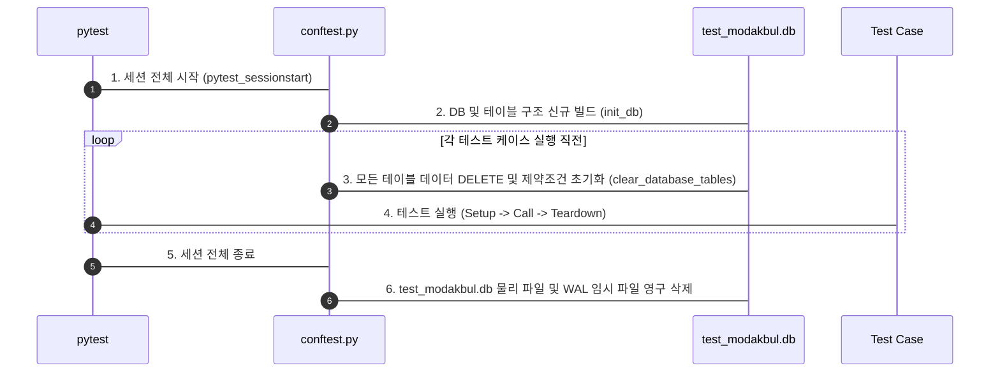

# 🧪 pytest 기반 테스트 구동 및 작성 가이드 (Testing Guide)

이 문서는 모닥불(Modakbul) 백엔드 서버의 자동화 테스트 환경을 빌드하고, 실행하며, 새로운 테스트 코드를 작성하는 방법을 정리한 개발자 가이드라인입니다.

---

## 1. 테스트 디렉터리 구조 (Directory Structure)

모닥불 프로젝트는 마이크로서비스 및 대형 프로젝트 규격에 맞춰 **도메인 및 엔드포인트 단위로 테스트 파일을 철저히 분격 격리**하여 설계했습니다.

```
tests/
├── conftest.py                # 테스트 데이터베이스 설정 및 공통 Fixtures
├── auth/                      # 인증 및 계정 도메인 API 테스트
│   ├── test_signup.py         # 회원가입 성공/실패(중복) 검증
│   ├── test_login.py          # 로그인 성공/실패 및 보안 예외 검증
│   ├── test_me.py             # 회원 정보 조회 및 JWT 검증
│   └── test_withdraw.py       # 본인 대조 기반 회원 탈퇴 검증
├── topics/                    # 모닥불 도메인 API 테스트
│   ├── test_create_topic.py   # 생성, 비인가 차단, 유사도 자동 매핑 검증
│   ├── test_read_feed.py      # 활성 피드 조회 및 지연 삭제(Lazy Deletion) 검증
│   ├── test_get_detail.py     # 특정 모닥불 상세 조회 및 댓글 결합 검증
│   └── test_get_detail_advanced.py # 상세 조회 경계값(만료/아카이브/댓글 페이징) 검증
├── comments/                  # 댓글 도메인 API 테스트
│   └── test_create_comment.py # 장작 추가, 수명 연장 폭, 산소 감쇠 정량 검증
├── gc/                        # 백그라운드 스케줄러 테스트
│   └── test_garbage_collect.py# GC의 2단계 데이터 아카이브 물리 이관 및 정합성 검증
├── core/                      # 알고리즘 및 엔진 단위 테스트
│   ├── test_embedding.py      # 128차원 L2 정규화 임베딩 벡터 생성 검증
│   ├── test_similarity.py     # 코사인 유사도 연산 검증
│   └── test_burn_rate.py      # 가변 연소율 및 스팸 방지 하한선(10초) 검증
└── scenarios/                 # [인수 테스트] 전체 사용자 시나리오 흐름 검증
    ├── test_user_flow.py      # 가입 ──► 로그인 ──► 인증 ──► 탈퇴 시나리오
    └── test_bonfire_lifecycle.py # 모닥불 개설 ──► 댓글 연장 ──► GC 이관 ──► 재(Ash) 피드 조회
```

---

## 2. 사전 준비 (Prerequisites)

테스트 스위트를 구동하기 위해서는 `pytest`와 TestClient 작동에 필요한 `httpx` 라이브러리가 가상환경에 설치되어 있어야 합니다.

```bash
# 가상환경 활성화 후 테스트 라이브러리 설치
pip install pytest httpx
```

---

## 3. 테스트 실행 방법 (Running Tests)

pytest의 **자동 테스트 발견 (Auto Test Discovery)** 기능 덕분에 단 한 줄의 명령어로 다양한 범위의 테스트를 수행할 수 있습니다.

### ① 전체 테스트 실행 (40개 케이스 전체 구동)
```bash
# 전체 테스트 실행 (간략히 요약 보기)
pytest


# 전체 테스트 실행 (각 엔드포인트별 통과 여부, 실시간 API 로그 및 커스텀 요약 통계 출력) - 권장
pytest -s -v
```

### ② 테스트 케이스 실시간 로깅 및 최종 요약 통계 (Custom Summary Statistics)
모닥불 프로젝트는 복잡한 테스트 결과를 직관적으로 파악할 수 있도록 `conftest.py`에 커스텀 터미널 리포팅 훅을 내장하고 있습니다.

1. **실시간 API 요청/응답 로깅**: 테스트 클라이언트(`client`)를 통해 호출되는 모든 API 요청의 Payload와 응답 Status Code/Body 요약(100자 축약)이 터미널에 실시간 출력되어 디버깅을 극대화합니다.
2. **카테고리 자동 태깅**: 각 테스트 케이스가 수행될 때 파일 경로를 분석하여 `[CORE UNIT]`, `[INTEGRATION]`, `[SCENARIO]` 분류 태그와 한글 시나리오 설명(docstring)을 깔끔하게 출력합니다.
3. **최종 요약 통계 테이블**: 전체 테스트 세션이 종료되면 각 카테고리별로 통과(Passed), 실패(Failed), 생략(Skipped), 에러(Error) 개수를 표 형태로 카운팅하고, 최종 성공률(Success Rate)을 집계하여 리포팅합니다.

#### 📝 실제 출력 리포팅 양식 예시
```text
tests/topics/test_get_detail_advanced.py::test_get_topic_detail_comments_pagination 

======================================================================
  >>> [INTEGRATION TEST] : test_get_topic_detail_comments_pagination
    - 검증 시나리오: 모닥불 상세 조회 시 댓글(장작) 목록이 limit와 offset에 따라 정상적으로 페이징(Pagination) 처리되는지 검증합니다.
======================================================================
C:\Users\gyeongho\Documents\GitHub\modakbul\db
Database initialized successfully.

      [API REQ]  POST /api/auth/signup | Payload(JSON): {'username': 'user1', 'password': 'password', 'nickname': '닉네임1'}
      [API RESP] Status: 201 | Body: {'message': '회원가입이 완료되었습니다.', 'user': {'id': 26, 'username': 'user1', 'nickname': '닉네임1'}}

      [API REQ]  POST /api/auth/login | Payload(Form): {'username': 'user1', 'password': 'password'}
      [API RESP] Status: 200 | Body: {'access_token': 'eyJhbGciOiJIUzI1NiIsInR5cCI6IkpXVCJ9.eyJzdWIiOiIyNiIsImV4cCI6MTc4MDc1NDgwNn0.mcJ3R... (truncated)

      [API REQ]  POST /api/topics/ | Payload(JSON): {'content': '댓글 페이징 테스트 방'}
      [API RESP] Status: 201 | Body: {'id': 28, 'content': '댓글 페이징 테스트 방', 'expires_at': '2026-06-06T14:56:46.118115Z', 'comment_count': ... (truncated)

      [API REQ]  GET /api/topics/28?limit=10&offset=0
      [API RESP] Status: 200 | Body: {'id': 28, 'content': '댓글 페이징 테스트 방', 'expires_at': '2026-06-06T14:56:46.118115Z', 'comment_count': ... (truncated)
PASSED

====================== MODAKBUL TEST SUMMARY STATISTICS =======================
 Category        |  Passed  |  Failed  | Skipped  |  Error   |  Total  
----------------------------------------------------------------------
 CORE UNIT       |    7     |    0     |    0     |    0     |    7    
 INTEGRATION     |    31    |    0     |    0     |    0     |    31   
 SCENARIO        |    2     |    0     |    0     |    0     |    2    
----------------------------------------------------------------------
 TOTAL           |    40    |    0     |    0     |    0     |    40   
----------------------------------------------------------------------
 Success Rate: 100.0% (40/40 passed)
===============================================================================
```

### ③ 특정 도메인 폴더만 실행
```bash
# Auth 관련 테스트만 일괄 구동
pytest tests/auth/ -v

# Core 수식/알고리즘 단위 테스트만 구동
pytest tests/core/ -v
```

### ④ 특정 테스트 파일 하나만 실행
```bash
# 가변 연소율 알고리즘 단위 테스트 파일만 실행
pytest tests/core/test_burn_rate.py -v
```

### ⑤ 특정 테스트 함수 하나만 필터링하여 실행
```bash
# test_burn_rate_minimum_limit 함수만 단독 실행
pytest tests/core/test_burn_rate.py -k "test_burn_rate_minimum_limit" -v
```

---

## 4. 테스트 환경 및 DB 격리 설계

테스트 실행 중 실제 프로덕션 데이터베이스(`modakbul.db`)가 오염되거나 데이터가 꼬이는 것을 막기 위해 `tests/conftest.py`에서 **완전한 테스트 데이터 격리 및 가상 환경 오버라이드**를 제공합니다.

### ① 공통 환경변수 오버라이드
`conftest.py`가 로드되면 Python 모듈들이 임포트되기 전에 강제적으로 테스트용 환경변수를 주입합니다.
* `DATABASE_URL = "sqlite:///./test_modakbul.db"`: 프로덕션 DB와 완벽히 격리된 테스트용 SQLite DB 사용 지정.
* `SECRET_KEY`: HMAC-SHA256 최소 길이 권고에 맞춰 **32바이트 이상**의 테스트 키 주입 (InsecureKeyLengthWarning 방지).
* `GARBAGE_COLLECTION_INTERVAL = "1"`: 가비지 컬렉터 스케줄링 간격을 1초로 축소하여 비동기 GC의 실시간 동작 시뮬레이션 지원.
* `BASE_MINUTES = "10.0"`: 모닥불 초기 수명을 10분으로 세팅하여 테스트 타임라인 통제.

### ② 테스트 격리 라이프사이클 (Mermaid)



---

## 5. 테스트 코드 작성 규칙 (Rule of Writing)

새로운 API나 비즈니스 기능 추가 시 테스트 코드는 아래 규칙을 준수하여 작성합니다.

1. **파일명 및 함수명 규칙**:
   - 파일명은 반드시 `test_*.py` 형식으로 명명해야 pytest 러너가 수집할 수 있습니다.
   - 테스트 함수 역시 반드시 `def test_*`로 시작해야 합니다.
2. **테스트 한글 Docstring 작성 의무**:
   - 모든 테스트 함수의 첫 번째 라인에는 반드시 **해당 테스트가 검증하는 핵심 비즈니스 시나리오를 한글로 설명하는 docstring**을 작성합니다. 이 설명은 터미널 테스트 리포트에 실시간으로 표기됩니다.
   ```python
   def test_example(client: TestClient):
       """여기에 적은 한글 설명이 테스트 구동 시 실시간으로 파싱되어 터미널에 노출됩니다."""
       # ...
   ```
3. **FastAPI TestClient 주입**:
   - API를 호출하는 통합/시나리오 테스트의 경우 함수의 매개변수로 `client` 피스처를 받아 호출하면, 실시간 페이로드 로깅 기능(`LoggingTestClient`)이 자동으로 래핑 적용됩니다.
4. **Pydantic 해체 주입 원칙 (Primitive Mapping)**:
   - 하위 계층(Service, Repository)을 직접 호출하는 단위 테스트를 작성할 경우, Pydantic DTO 객체 형태 그대로 주입하지 말고 데이터를 해체하여 **파이썬 기본 자료형(`str`, `int`, `dict`)**으로 쪼개어 인자에 전달하도록 설계합니다. 이는 계층 간 의존성을 낮추고 테스트 안정성을 배가시킵니다.
5. **분류에 맞는 폴더 배치**:
   - `core/`: 알고리즘 수식 및 핵심 헬퍼 함수 단위 테스트
   - `auth/`, `topics/`, `comments/`, `gc/`: 엔드포인트 및 도메인 단위 통합 테스트
   - `scenarios/`: 여러 도메인의 API를 결합한 종합 사용자 라이프사이클 시나리오 검증

